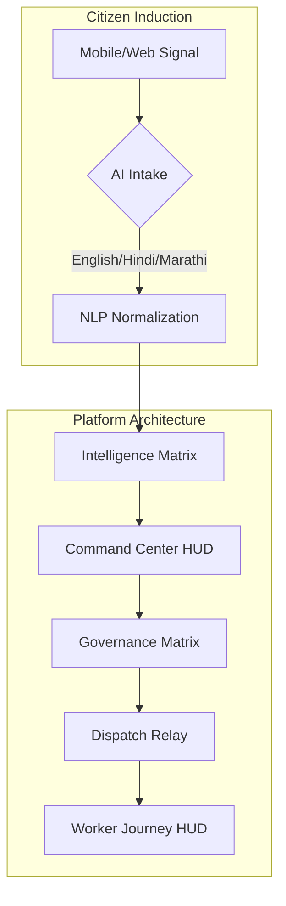

# CivicResource.ai 🏛️🧠

**CivicResource.ai** is an AI-assisted civic operations platform that connects complaint intake, dispatch intelligence, and field execution in one operational flow.

---

## 🏛️ Core Innovation Pillars

### 1. The Intelligence Matrix (Analysis)
Combines multi-modal signals into actionable urban insights.

- **Dynamic Demand Forecasting**: Predicts zonal pressure using ensemble-learning.
- **Intelligent Complaint Triage**: NLP-driven validation of citizen reports in English, Hindi, and Marathi.
- **Hotspot Clustering**: Identifies geographic incident trends using DBSCAN.

### 2. The Governance Matrix (Compliance)
Ensures accountability through automated logic and audit trails.

- **SLA Efficiency Tracking**: Monitors response times against municipal mandates.
- **Strategic Allocation**: Haversine-optimized resource dispatch with "Need-Matching."
- **Protocol Integrity**: Auditable Protocol IDs for every urban incident.

---

## 🚀 System Architecture

---

## 🛣️ Major Capabilities

### 📋 Complaint Intake & Trust
- **Multilingual Intake**: Normalizes reports in English, Hindi, and Marathi.
- **Trust Scoring**: AI-assisted triage and civic relevance checks.
- **Duplicate Fusion**: Clustering repeated reports into a single actionable signal.

### 🧠 AI & Optimization
- **Demand Forecasting**: Zone urgency scoring and crisis mode templates (Flood, Festival, Strike, Heatwave).
- **Explainable Allocation**: Suggestions with scoring factors for transparent decision support.

### ⚡ Dispatch & Operations
- **Live Dispatch Panel**: Dynamic "Apply-Plan" flow with smart fallback recommendations.
- **Worker Journey Simulation**: Real-time tracking of route lifecycle (En-route, On-site, Resolved).
- **ETA Countdown**: Precise mm:ss updates synced across Worker and Admin maps.

---

## 🛠️ Tech Stack & Layout

### Technology Stack
- **Client**: React 18, Vite, Tailwind CSS, Framer Motion, React Leaflet.
- **Server**: Node.js, Express, MongoDB + Mongoose, JWT Auth.
- **AI Engine**: FastAPI, Scikit-Learn Ensemble, NLP (SpaCy).
- **Mobile**: Expo, React Native.

### Repository Layout
- **`client/`**: Web UI and operational dashboards.
- **`server/`**: API routes, business logic, and simulation scripts.
- **`ai-engine/`**: AI services, training scripts, and model assets.
- **`mobile-app/`**: Workflows for citizen and field usage.

---

## 🚀 Local Setup

1. **Install Dependencies**:
   - `server/`: `npm install`
   - `client/`: `npm install`
   - `ai-engine/`: `pip install -r requirements.txt`

2. **Run Services**:
   - `server/`: `npm run dev`
   - `client/`: `npm run dev`
   - `ai-engine/`: `uvicorn main:app --reload --port 8000`

---
## ✅ Latest Updates (Apr 2026)

### Dispatch Reliability & Allocation Quality
- **Type-Safe Dispatch Assignment**: Water/utility complaints can no longer be assigned to police responders.
- **Apply Button Hardening**: Manual **Apply** now selects the nearest compatible available worker instead of falling back to unrelated worker types.
- **Backend Guardrails**: `/api/dispatch/assign` now rejects personnel type mismatches with explicit `skipped_type_mismatch` results.
- **Status Integrity**: Incident `dispatchStatus` is now only marked `dispatched` when at least one valid dispatch actually occurs.

### Live Plan Behavior
- **Live Apply Plan Compatibility**: Maintains proximity-aware assignment while honoring responder-family compatibility for safer auto-allocation.
- **Operational Transparency**: Assignment results now clearly indicate when candidates were skipped due to mismatch.

### Multilingual UX Refinements
- **Native Language Labels** on public selectors:
    - Hindi shown as **हिंदी**
    - Marathi shown as **मराठी**
    - English shown as **English**
- Applied in both **Complaint Intake** and **Landing Page** language switchers.

---
*Built for Civic Excellence & Modern Urban Governance.*
