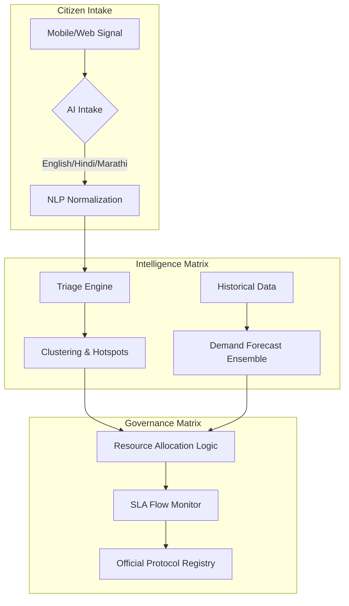

# CivicFlow AI Engine 🧠🏛️

[](https://fastapi.tiangolo.com/)
[](https://scikit-learn.org/)
[]()

The **CivicFlow AI Engine** is the predictive "Brain" of the CivicResource.ai platform. It delivers real-time urban analytics, demand forecasting, and automated complaint triage using modern machine learning and NLP protocols.

---

## 🏛️ Core Innovation Pillars

### 1. The Intelligence Matrix (Analysis)
Combines multi-modal signals into actionable urban insights.

- **Dynamic Demand Forecasting**: An ensemble method blending **Random Forest** and **Gradient Boosting** to predict zonal pressure.
- **Intelligent Complaint Triage**: NLP-driven classification and "Fake Score" heuristics to validate citizen reports in English, Hindi, and Marathi.
- **Hotspot Clustering**: Uses **DBSCAN** spatial clustering to identify geographic incident trends.

### 2. The Governance Matrix (Compliance)
Ensures accountability through automated logic and audit trails.

- **SLA Efficiency Tracking**: Real-time monitoring of response times against municipal mandates.
- **Strategic Allocation**: Haversine-optimized resource dispatch with "Need-Matching" technology.
- **Protocol Integrity**: Automated generation of auditable Protocol IDs for every incident.

---

## 📊 System Architecture



---

## 🛣️ API Endpoints

### Urban Analytics (`/analyze/*`)
| Endpoint | Method | Input | Output |
| :--- | :--- | :--- | :--- |
| `/analyze/demand-forecast` | `POST` | Zonal features | Urgency scores & Forecasts |
| `/analyze/complaint-intake` | `POST` | Raw text | Intent detection & Relability |
| `/analyze/resource-allocation`| `POST` | Units + Demands | Optimal Dispatch Plan |
| `/analyze/clustering` | `POST` | Incident list | Geographic Hotspots |
| `/analyze/heatmap-weights` | `POST` | Incident list | Mapping intensity weights |

### Model Lifecycle (`/model/*`)
| Endpoint | Method | Description |
| :--- | :--- | :--- |
| `/model/status` | `GET` | Retrieve demand model training metrics. |
| `/model/triage-status` | `GET` | Retrieve triage model training metrics. |
| `/model/train` | `POST` | Retrain demand models from latest CSV. |
| `/model/train-triage` | `POST` | Retrain triage models from latest CSV. |

---

## 🛠️ Data Integrity & Scripts

The engine includes a suite of verification and training tools:

- **`generate_data.py`**: Synthetic dataset generator for historical demand and triage scenarios.
- **`verify_data.py`**: *(New)* Data integrity and model verification script for high-confidence deployments.
- **`scripts/train_with_open_data.py`**: Pipeline for bootstrapping models with public municipal datasets.

---

## 🚀 Setup & Execution

1. **Install Dependencies**:
   ```bash
   pip install -r requirements.txt
   ```

2. **Run the Engine**:
   ```bash
   python main.py
   ```
   *Starts on [http://localhost:8000](http://localhost:8000)*

3. **Retrain Models**:
   ```bash
   curl -X POST http://localhost:8000/model/train
   curl -X POST http://localhost:8000/model/train-triage
   ```

---
*Built for Civic Excellence & Modern Urban Governance.*
